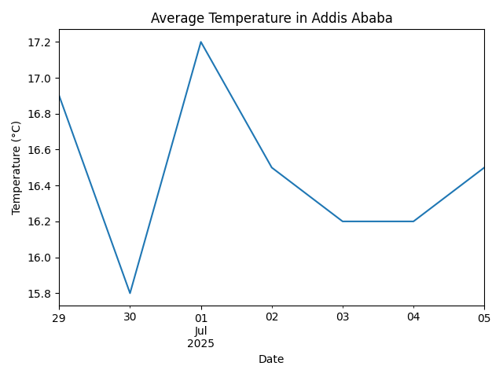

# 🌦️ Weather Scraper using Meteostat

This project scrapes weather data for Addis Ababa over the last 7 days using Python and Meteostat, and visualizes the average temperature.

## Setup
- Clone the repo
- Create a virtual environment
- Install dependencies from `requirements.txt`
- Run `weather_scraper.py`

## Output
- CSV file with daily weather data
- Line chart showing temperature trends
- Below is the chart showing average temperature over the past 7 days in Addis Ababa:

## Technologies
- Python, Meteostat, Pandas, Matplotlib
